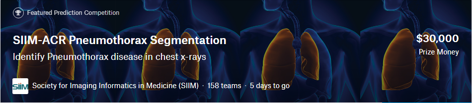

# Convolutional Neural Networks for Pneumothorax Segmentation

This repository contains code for my approach to the [2019 SIIM-ACR Pneumothorax Segmentation Kaggle Challenge](https://www.kaggle.com/c/siim-acr-pneumothorax-segmentation/overview). Implemented using `tensorflow.keras`.

## Credits to Amazingly Helpful Kernels
* [Preprocessed dataset](https://www.kaggle.com/iafoss/siimacr-pneumothorax-segmentation-data-256) from this [kernel](https://www.kaggle.com/iafoss/data-repack-and-image-statistics) by [lafoss](https://www.kaggle.com/iafoss)
* [Unet Plus Plus with EfficientNet Encoder](https://www.kaggle.com/meaninglesslives/unet-plus-plus-with-efficientnet-encoder) and [Unet with EfficientNet Encoder in Keras](https://www.kaggle.com/meaninglesslives/unet-with-efficientnet-encoder-in-keras) by [Siddhartha](https://www.kaggle.com/meaninglesslives)

## Preprocessing
The only preprocessing that was done was CLAHE and rescaling the intensities to [0, 255]. The output images were converted to .png files.

## Solution
`[0.8523 Public LB // 0.8980 Private (1% of test data)]` 
__Note__: Models were not retrained on the stage 1 test labels. 
My final solution was essentially just running the [Unet Plus Plus with EfficientNet Encoder](https://www.kaggle.com/meaninglesslives/unet-plus-plus-with-efficientnet-encoder) kernel 10 different times and ensembling the SWA snapshots with horizontal flipping for test-time augmentation and zeroing out predictions with small ROIs (`pneumothorax_seg.inference.segmentation_only.py`). There were some variations in the models I ensembled (mainly, the data augmentation), but they didn't have much impact on the overall performance across folds. Here are [the model weights I used](https://drive.google.com/open?id=11pYZOlIxk8OKERujxWQje1eTLSUB_l7I).

## What about the other models?
### Classification-Segmentation Cascade
`[Best: 0.8500 Public LB]` 
With this approach, I was planning on replicating something similar to the [1st Place Solution to the RSNA Pneumonia Detection Challenge](https://www.kaggle.com/c/rsna-pneumonia-detection-challenge/discussion/70421), where they used ensembles of classification models (5 10-fold CV ensembles) in conjuction with ensembles of detection models. Both that challenge and this one used the [NIH ChestXray14 Dataset](https://www.kaggle.com/nih-chest-xrays/data), and __they also released pre-trained weights on said dataset.__
* used binary cross entropy, Adam, SWA, and a cosine annealing LR.
* Data augmentation was horizontal flipping, color inversion, gaussian smoothing, rotations, zooms, and random gamma ([as shown here](https://github.com/jchen42703/pneumothorax-seg-cnn/blob/master/pneumothorax_seg/io/data_aug.py))

I found that I couldn't really get any real worthwhile performance improvements with a small ensemble of 4 classification models on a single fold (EfficientNetB4 with ImageNet weights; DenseNet169, InceptionResNetV2, and Xception on NIH weights) and the UEfficientNetB4 trained on pneumothorax positive patients only, so I just reverted back to segmentation only approaches. (Classification F-Scores were around 0.7-0.76 and AUCs around 0.82-0.87 depending on the thresholds). It would probably do better with larger ensembles, but time was a serious constraint with limited computing power.

__However, I did create a cleaner version found in the [original repository](https://github.com/i-pan/kaggle-rsna18) to load the NIH weights in the classification models, which is found in `pneumothorax_seg.training.utils.load_pretrained_classification_model`.__

### Misc. Approaches
* [Regular U-Net](https://github.com/jchen42703/pneumothorax-seg-cnn/blob/master/pneumothorax_seg/models/unet/models.py): Just did a basic recursive tf.keras implementation with conv, LeakyReLU, and Instance Normalization. However, it didn't do too well (CV < 0.75), so I opted to just use the U-Net++. (This was done on 512x512 inputs).
* [VAE CNN](https://github.com/jchen42703/pneumothorax-seg-cnn/blob/master/pneumothorax_seg/models/vae_cnn/models.py): This architecture is from an [unofficial implementation](https://github.com/IAmSuyogJadhav/3d-mri-brain-tumor-segmentation-using-autoencoder-regularization) of the [1st place solution to the 2018 MICCAI Brain Tumour Segmentation Challenge](https://arxiv.org/pdf/1810.11654.pdf). I just made a 2D version so that it fit the code style in this repository and that it worked for `tensorflow.keras` and `channels_last`. I didn't play with it much, but it did about as well as the vanilla U-Net, while consuming a lot more compute time. (This was also done on 512x512 inputs). Better hyperparameter tuning might've made a bigger difference, but I didn't have much compute to work with.
